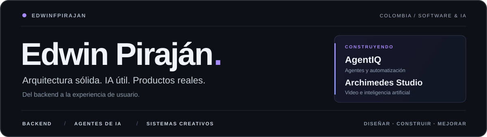
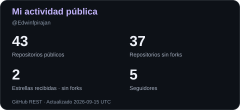
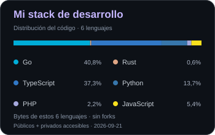
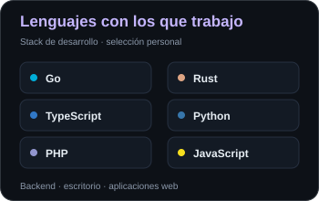

  

  
  
  
  

## Sobre mí

Soy **Edwin Fernando Piraján Arévalo**, desarrollador y arquitecto de software en Colombia. Diseño backends, sistemas conversacionales y productos con inteligencia artificial, desde la arquitectura hasta la experiencia de usuario.

Trabajo principalmente con **Go, TypeScript y Python**, y desarrollo herramientas de escritorio con **Rust**. Me interesan los agentes que usan herramientas, la automatización de procesos y el software que hace accesible una tecnología compleja sin complicarle la vida al usuario.

## Lo que construyo

<table>
  <tr>
    <td width="33%" valign="top">
      <h3>🤖 Agentes de IA</h3>
      
Sistemas conversacionales, integración de modelos, RAG y agentes con herramientas conectadas a procesos reales.

    </td>
    <td width="33%" valign="top">
      <h3>🎬 Herramientas creativas</h3>
      
Edición de video asistida por IA, aplicaciones de escritorio y experiencias centradas en el control del usuario.

    </td>
    <td width="33%" valign="top">
      <h3>⚙️ Backend y arquitectura</h3>
      
APIs, plataformas multi-tenant, integraciones en tiempo real y automatización con foco en seguridad y mantenibilidad.

    </td>
  </tr>
</table>

## Proyectos destacados

<table>
  <tr>
    <td width="50%" valign="top">
      <h3>🤖 <a href="https://agentiq.com.co/">AgentIQ</a></h3>
      
Plataforma de agentes de IA y comunicación omnicanal que conecta conversaciones, automatización y herramientas de negocio.

      
<code>Go</code> <code>TypeScript</code> <code>Python</code> <code>IA conversacional</code>

      <a href="https://agentiq.com.co/">Conocer el proyecto →</a>
    </td>
    <td width="50%" valign="top">
      <h3>🎬 Archimedes Studio</h3>
      
Editor de video de escritorio asistido por IA, con núcleo Rust y enfoque local-first: una experiencia potente y sencilla para crear.

      
<code>Rust</code> <code>Tauri</code> <code>Vue</code> <code>TypeScript</code>

      En desarrollo · Alpha · Repositorio privado
    </td>
  </tr>
</table>

**✍️ [LinguaForge](https://linguaforgeapp.com/)** — Aprendizaje de idiomas con lecciones interactivas y contenidos asistidos por IA. Construido con Next.js y Node.js.

## Tecnologías

**Lenguajes y backend**

  
  
  
  
  
  

**Interfaces, datos e infraestructura**

  
  
  
  
  
  
  
  
  

  
Más herramientas con las que trabajo

   
  
<strong>Backend:</strong> FastAPI, NestJS, Express y Laravel.

  
<strong>IA y automatización:</strong> LangChain, RAG, tool-calling, integración de modelos, WebSockets y Chrome DevTools Protocol.

  
<strong>Datos e infraestructura:</strong> MongoDB, SQL Server, Nginx y AWS.

## Mi actividad y stack

  
  

  La actividad refleja datos públicos. El stack calcula la proporción de código (bytes) entre los seis lenguajes mostrados: repositorios propios sin forks, en sus ramas predeterminadas, incluidos los privados accesibles. CSS y otros lenguajes quedan fuera del total. No mide dominio técnico ni autoría personal.

  
Ver estadísticas de lenguajes públicos

   
  

    
  

  

    Porcentaje de repositorios públicos según su lenguaje principal, sin forks. No mide dominio técnico ni incluye repositorios privados.
  

## 🐍 Mis contribuciones, versión Snake

  <picture>
    <source media="(prefers-color-scheme: dark)" srcset="./profile/contribution-snake-dark.svg" />
    <source media="(prefers-color-scheme: light)" srcset="./profile/contribution-snake.svg" />
    
  </picture>

  Mis contribuciones se convierten en el recorrido de la culebrita. Actualización diaria automática.

---

  <strong>¿Hablamos de software, IA o una colaboración?</strong> 
  <a href="mailto:efpa1998@hotmail.com">Email</a> ·
  <a href="https://www.linkedin.com/in/edwin-arevalo-119b1215b/">LinkedIn</a> ·
  <a href="https://agentiq.com.co/">AgentIQ</a> ·
  <a href="https://youtube.com/@ProgramaThor">YouTube</a>

  Menos complejidad para el usuario. Más posibilidades para crear.

